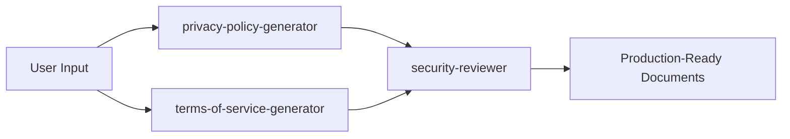
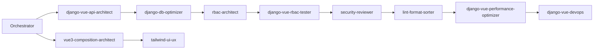
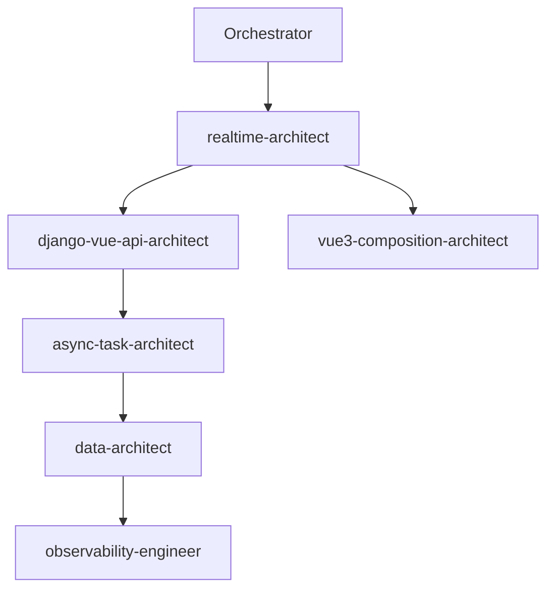
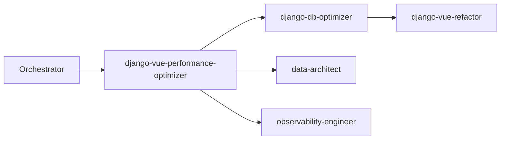

# 🚀 Agent Ecosystem v2.0

## Overview

This is the enhanced and orchestrated agent ecosystem for Django/DRF backend with JWT authentication and Vue.js frontend with Pinia state management and Tailwind CSS. Now includes specialized legal document generators for production-ready privacy policies and terms of service.

## 🎯 Key Improvements

### Consolidation

- **RBAC agents merged** into unified `rbac-architect`
- **Security review enhanced** in `security-reviewer`
- **Clear boundaries** established between all agents

### New Capabilities

- **`project-orchestrator`**: Master coordinator for complex workflows
- **`data-architect`**: Data modeling, caching, and pipeline management
- **`observability-engineer`**: Monitoring, debugging, and observability
- **`realtime-architect`**: WebSocket and real-time features
- **`async-task-architect`**: Background jobs and queue management
- **`privacy-policy-generator`**: GDPR/CCPA compliant privacy policies
- **`terms-of-service-generator`**: Legally enforceable terms of service

## 📂 Agent Directory

### 🎭 Orchestration

| Agent | Purpose | Model |
|-------|---------|-------|
| `project-orchestrator` | Coordinates multi-agent workflows | opus |

### 💻 Development

| Agent | Purpose | Model |
|-------|---------|-------|
| `django-vue-api-architect` | REST API development | sonnet |
| `vue3-composition-architect` | Vue.js frontend development | sonnet |
| `tailwind-ui-ux` | CSS and design systems | sonnet |
| `django-vue-refactor` | Code refactoring (RefactorA/RefactorX) | - |

### 🗄️ Data & Infrastructure

| Agent | Purpose | Model |
|-------|---------|-------|
| `data-architect` | Data modeling and caching | opus |
| `django-db-optimizer` | Database query optimization | sonnet |
| `django-migration-architect` | Database migrations | sonnet |
| `async-task-architect` | Background tasks and queues | opus |
| `realtime-architect` | WebSocket and real-time | opus |

### 🔒 Security & Quality

| Agent | Purpose | Model |
|-------|---------|-------|
| `rbac-architect` | RBAC design and implementation | opus |
| `security-reviewer` | Comprehensive security audits | opus |
| `django-vue-rbac-tester` | Test automation | sonnet |
| `django-vue-performance-optimizer` | Performance optimization | opus |
| `lint-format-sorter` | Code formatting and linting | sonnet |
| `observability-engineer` | Monitoring and debugging | opus |

### 🚀 Operations

| Agent | Purpose | Model |
|-------|---------|-------|
| `django-vue-devops` | Deployment and infrastructure | sonnet |

### 📜 Legal & Compliance

| Agent | Purpose | Model |
|-------|---------|-------|
| `privacy-policy-generator` | Generate GDPR/CCPA compliant privacy policies | opus |
| `terms-of-service-generator` | Generate enforceable terms of service | opus |

## 🔄 Workflow Examples

### Legal Document Generation



### New Feature Development



### Real-time Feature Implementation



### Performance Optimization



## 🚦 Using the Orchestrator

### Simple Request

```markdown
User: "Create a user dashboard with real-time notifications"
Orchestrator: Decomposes into tasks for realtime-architect, vue3-composition-architect, django-vue-api-architect, and others
```

### Complex Workflow

```python
# The orchestrator handles:
1. Task decomposition
2. Dependency management
3. Parallel execution
4. Result aggregation
5. Conflict resolution
6. Progress tracking
```

## 📊 Agent Communication Protocol

All agents support standardized messaging:

```yaml
agent_message:
  from: source_agent
  to: target_agent
  type: [request|response|notification]
  context:
    task_id: unique_id
    priority: [critical|high|medium|low]
  payload:
    action: required_action
    data: relevant_data
```

## 🛡️ Quality Gates

Each agent implements quality checks:

- **Pre-execution validation**
- **Progress monitoring**
- **Post-execution verification**
- **Error handling and recovery**
- **Performance metrics**

## 🚨 Emergency Response

Pre-configured emergency teams:

### Production Down

- `django-vue-devops`
- `observability-engineer`
- `django-db-optimizer`

### Security Breach

- `security-reviewer`
- `rbac-architect`
- `django-vue-devops`

### Data Issues

- `django-migration-architect`
- `data-architect`
- `django-db-optimizer`

## 📈 Metrics & Monitoring

The orchestrator tracks:

- Agent utilization rates
- Task completion times
- Error rates and recovery
- Collaboration patterns
- Performance improvements

## 🔧 Configuration

Each agent can be configured for:

- Execution strategies (sequential/parallel)
- Error handling policies
- Resource limits
- Quality thresholds
- Collaboration preferences

## 🎯 Best Practices

1. **Always use the orchestrator** for complex tasks
2. **Let agents specialize** - don't bypass their expertise
3. **Monitor progress** through orchestrator updates
4. **Trust quality gates** - they prevent issues
5. **Learn from metrics** - optimize common workflows

## 🚀 Getting Started

1. For simple tasks: Call specific agents directly
2. For complex features: Use `project-orchestrator`
3. For emergencies: Invoke emergency response teams
4. For optimization: Start with `django-vue-performance-optimizer`

---

*"Orchestrated agents deliver harmonious code"* 🎼
